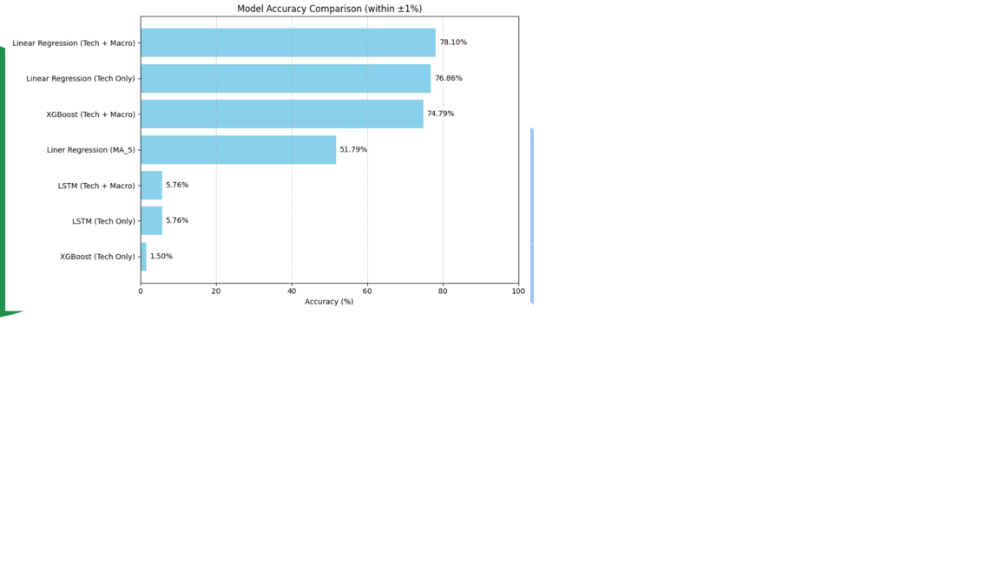

# stock-price-prediction

# Quick review from google colab link: 
https://colab.research.google.com/drive/1ZTnAaI7VTn6Lf-VuRMKoZZ5V1ugEH3xS?usp=sharing

### 📈 Model Performance Comparison

# Stock Price Prediction Using Technical & Macroeconomic Indicators
This project was a collaborative effort between two team members, including myself, developed as part of our academic curriculum. We focused on analyzing the QQQ stock dataset from 2020 to the end of 2024.

To enhance the dataset and improve model performance, we incorporated both technical indicators (such as closing price, opening price, MA5, and others) and macroeconomic factors (like gold price, unemployment rate, and consumer index) that directly influence the stock market.

We developed and compared the performance of the following three models:

Linear Regression

XGBoost

LSTM (Long Short-Term Memory)

Model performance was evaluated using Mean Absolute Error (MAE) and Accuracy Score.
🔍 The Linear Regression model that used both technical and macroeconomic indicators achieved the best performance with 78% accuracy, showing strong predictive power beyond chance.

📁 File Overview
QQQ Final - Presentation Slides.pptx
Presentation summarizing the project methodology and results.

QQQ_stock_marcket_Coding_Final.ipynb
Full Python notebook containing data preprocessing, EDA, modeling, and evaluation.

QQQ (200101-241231)(in).csv
Original dataset used as the starting point.

enhanced_stock_data.xls
Final dataset enriched with technical and macroeconomic features.
